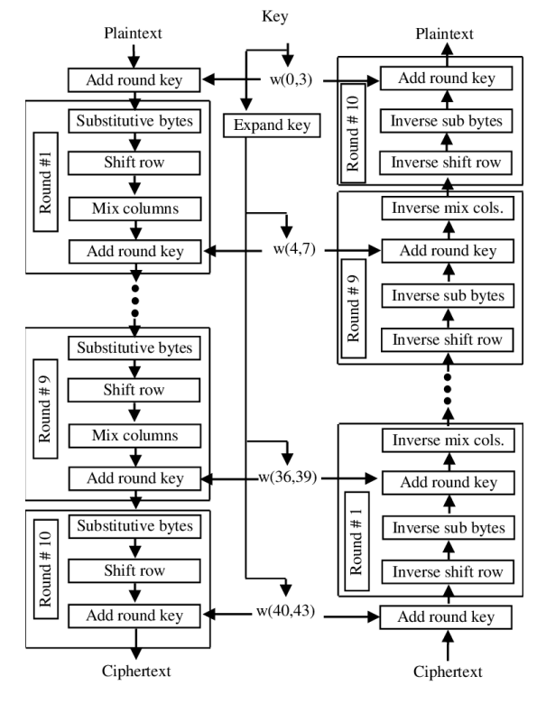

# Assignment on Diffie-Hellman Key Exchange and AES

## Diffie-Hellman Key Exchange

See details in [diffie_gui/README.md](diffie_gui/README.md).

## AES Encryption

AES-128 overview:

The AES encryption and decryption process is as follows:

- The input is divided into 128-bit plaintext blocks. If the last block is less than 128 bits, it is padded with zeros.
- The blocks are then passed through 10 rounds of encryption.
- The key is expanded to 11 round keys of 128 bits each. The first round key is the original key. The remaining 10 round keys are generated using the original key.
- Each round consists of the following steps:
  - SubBytes: Each byte of the block is replaced by another byte according to a lookup table (`sbox`).
  - ShiftRows: The bytes of the block are shifted cyclically to the left.
  - MixColumns: Each column of the block is multiplied with a fixed polynomial.
  - AddRoundKey: The round key is XORed with the plaintext block.
- The last round is the same as the previous rounds except that there is no Mix Columns step.

For AES-192 and AES-256, only the key expansion part is different. The encryption and decryption part is the same as AES-128. For more details, see [this](https://crypto.stackexchange.com/a/2496/109182).

## RSA Key Exchange

See details in [rsa_gui/README.md](rsa_gui/README.md).

## Using RSA for Authentication

Suppose, Alice and Bob want to communicate with each other. Bob wants to make sure that he is communicating with Alice and not someone else. This is where authentication comes in. Authentication is the process of verifying the identity of a user. The process is as follows:

- Alice can authenticate her message by encrypting it with her private key. Since only Alice has access to her private key, no one else can encrypt the message using her private key.
- Bob can verify the authenticity of the message by decrypting it using Alice's public key. If the message is successfully decrypted, then Bob can be sure that the message was sent by Alice.
- However, anyone can decrypt the message using Alice's public key. In order to ensure that only Bob can decrypt the message, Alice can encrypt the message using Bob's public key, and then encrypt the result using her private key. This is called signing the message.
- Bob can verify the authenticity of the message by decrypting it using Alice's public key and then decrypting the result using his private key. If the message is successfully decrypted, then Bob can be sure that the message was sent by Alice.
